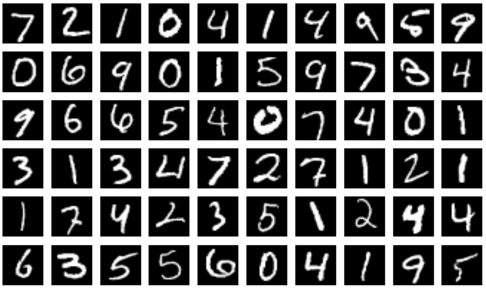

# CPSC 542: Convolutional Neural Network Implementation - Assignment #1

## Author Information
- **Name:** Lewis, T.
- **Email:** tylewis@chapman.edu
- **ID:** 002366930
- **Date:** 02/27/24

## Project Overview
This project involves the implementation of a Convolutional Neural Network (CNN) for the purpose of classifying images from the MNIST dataset. The MNIST dataset comprises 70,000 greyscale images of handwritten digits (0 through 9), each of 28x28 pixels resolution. This assignment is part of the coursework for CPSC 542 at Chapman University, focusing on leveraging deep learning for vision-based classification tasks.

## Background
Prior to this assignment, my experience with computer vision tasks primarily involved using the Euclidean Distance K-nearest neighbors algorithm to predict labels for the MNIST dataset. However, this approach yielded a maximum accuracy of approximately 0.9. The objective of this assignment is to demonstrate the superiority of CNNs over simpler algorithms for image classification tasks, particularly in recognizing patterns in handwritten numeric characters.

## Project Goals
1. **Prove the Necessity for Deep Learning:** To illustrate why deep learning, and CNNs in particular, are more suited for the classification of the MNIST dataset than traditional machine learning methods.
2. **Improve Classification Accuracy:** To significantly enhance the accuracy of pattern recognition in handwritten digits by employing a CNN model.
3. **Application Potential:** Highlight the potential application of such a model in transcribing scanned documents, aiding in the digitization of historical texts.

## Dataset
The MNIST dataset is utilized for this project. It features:
- 70,000 greyscale images.
- 28x28 pixel resolution per image.
- Handwritten numeric characters (0-9).
  
## Methods
### Preprocessing
- The MNIST dataset images are transformed to tensor format to facilitate processing by PyTorch.
- A dataset split is applied, allocating 75% of the images for training and 25% for validation. This approach is intended to gauge the model's  capability on unseen data.

### Model Architecture
  The model employs a LeNet architecture, featuring a sequential arrangement of layers designed to process the input images:
  - **Convolutional Layers:** Two convolutional layers are included, where the first layer applies 20 filters of size 5x5, and the second layer uses 50 filters of the same size. These layers are responsible for extracting features from the input images.
  - **Activation Functions:** Each convolutional layer is followed by a ReLU activation function to introduce non-linearity, enhancing the model's learning capability.
  - **Pooling Layers:** Max-pooling layers follow each activation function, reducing the spatial size of the representation and hence the number of parameters and computation in the network.
  - **Fully Connected Layers:** After flattening the output from the convolutional layers, it is passed through a fully connected layer with 500 units, followed by a ReLU activation, culminating in a softmax classifier that outputs the probability distribution over the 10 digit classes.

## Results
- **Training Configuration:** The network is trained over 10 epochs with a batch size of 64, employing the Adam optimizer and a learning rate of 1e-3.
- **Evaluation:** Upon completion of training, the model is assessed on a separate test dataset, and a classification report is generated. This report details the model's precision, recall, and F1-scores for each digit class, offering a comprehensive evaluation of its classification efficacy.
- **Performance Monitoring:** A history of training and validation loss and accuracy is maintained throughout the training epochs, serving as a metric for evaluating the model's performance.

### Evaluation on the Test Set
The evaluation results are as follows:

- **Accuracy:** The model achieved an overall accuracy of 99% on the test set, indicating a high level of proficiency in classifying handwritten digits from the MNIST dataset.

- **Precision, Recall, and F1-Score by Class:**
  - **0 - Zero:** Precision: 0.99, Recall: 0.99, F1-Score: 0.99
  - **1 - One:** Precision: 1.00, Recall: 0.99, F1-Score: 0.99
  - **2 - Two:** Precision: 0.99, Recall: 0.99, F1-Score: 0.99
  - **3 - Three:** Precision: 0.99, Recall: 0.98, F1-Score: 0.99
  - **4 - Four:** Precision: 0.97, Recall: 1.00, F1-Score: 0.98
  - **5 - Five:** Precision: 0.96, Recall: 0.99, F1-Score: 0.98
  - **6 - Six:** Precision: 0.99, Recall: 0.99, F1-Score: 0.99
  - **7 - Seven:** Precision: 0.98, Recall: 0.99, F1-Score: 0.99
  - **8 - Eight:** Precision: 0.98, Recall: 0.98, F1-Score: 0.98
  - **9 - Nine:** Precision: 0.99, Recall: 0.96, F1-Score: 0.98

### Plots/Figures
](visualization.png)
- A graphical representation showcases the trend in training and validation loss and accuracy across epochs. This visualization aids in identifying any signs of overfitting or underfitting and in understanding how the model's performance evolves with training.
## How to Run the Code
Instructions for setting up the environment, installing dependencies, and running the code for replication and further experimentation will be provided here.

