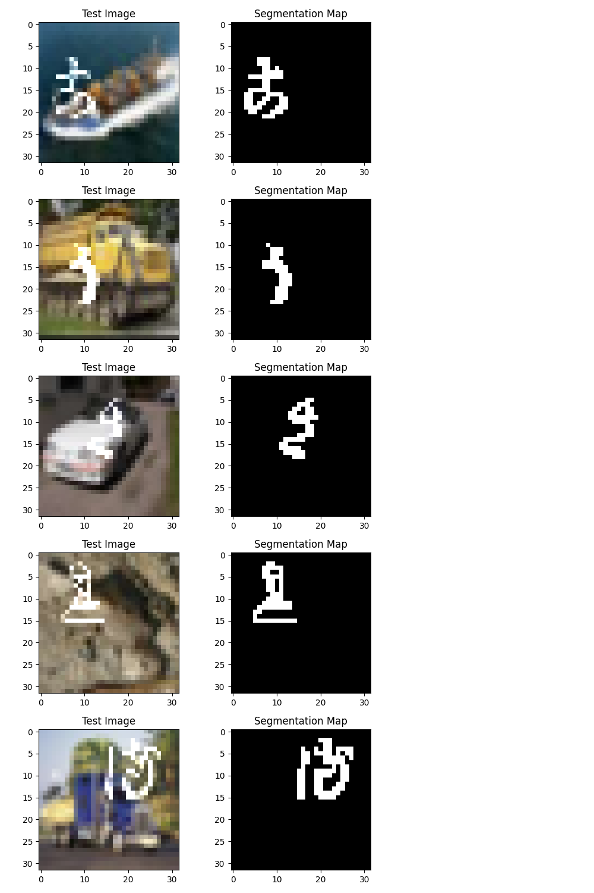

# [Semantic Segmentation using CNN Implementation](https://github.com/tylew/tylew/tree/main/Chapman/Spring%202024/CPSC%20542%3A%20DL%20%26%20CV/ASSN-2)

## Author Information
- **Name:** Lewis, T.
- **Email:** tylewis@chapman.edu
- **ID:** 002366930
- **Date:** 02/27/24

## Project Overview
[(containing repo)](https://github.com/tylew/tylew/tree/main/Chapman/Spring%202024/CPSC%20542%3A%20DL%20%26%20CV/ASSN-2)

In a previous assignment, a convolutional architecture was utilized to classify handwritten Japanese characters, presenting a challenge when considering real-world applications where characters are typically part of complex images. This assignment explores the potential of segmentation analysis to isolate characters from background noise for more accurate classification. A Deep Neural Network (DNN), leveraging a convolutional neural network's ability to identify spatial relationships, is proposed for effective image character segmentation.

### Dataset and Preprocessing
This project builds upon the previous classification assignment, using a custom dataset created by overlaying characters from the K-MNIST dataset over images from the CIFAR database. The greyscale dataset for classification was adapted by downsampling handwritten character images to half the size of a CIFAR image and overlaying them at random locations, with slight randomization in the color channels to introduce variability. This preprocessing approach allows for the generation of both test images and valid segmentation maps at runtime.

- CIFAR Images: 32x32 RGB
- K-MNIST Images: 28x28 BW, downsampled to 14x14



### Methods
#### Model Architecture
The model employs a series of neural network components for semantic segmentation, including:
- **Convolutional Layers:** Five layers designed to capture handwritten character patterns, with an arrangement of neurons per layer as 3(in), 12, 10, 8, 4, 1(out), using stride=1, and kernel size=5.
- **ReLU Activation:** Applied after the first three convolutional layers to introduce non-linearity and mitigate the vanishing gradient problem.
- **Dropout:** Used as a regularization technique after each ReLU activation in the first three layers to prevent overfitting by randomly setting a fraction of input units to 0 during training.
- **Sigmoid Activation:** Applied after the last convolutional layer for binary classification of each pixel as belonging to the foreground or background.

#### Hyperparameters
- **Learning Rate (INIT_LR = 0.001):** Chosen to balance convergence speed and stability.
- **Dropout Rate (DROPOUT = 20%):** To reduce overfitting by omitting 20% of the neurons during training.
- **Batch Size (BATCH_SIZE = 64):** Selected for computational efficiency and to maintain stochastic training behavior.
- **Epochs (EPOCHS = 10):** To ensure adequate learning without overfitting.

### Evaluation
Model performance was assessed using the Mean Intersection over Union (mIoU) metric, a standard for segmentation tasks measuring the overlap between predicted segmentation and ground truth normalized by their union. This metric effectively evaluates the model's accuracy in distinguishing between foreground and background elements across the dataset.

## Sources
- [**[DATASET REPO]** Kuzushiji-49 & KMNIST Datasets](https://github.com/rois-codh/kmnist#The%20Dataset)
- [**[DATASET REPO]** CIFAR-10 Dataset](https://www.cs.toronto.edu/~kriz/cifar.html)
- [Guide to Lenet Architecture ](https://www.kaggle.com/code/blurredmachine/lenet-architecture-a-complete-guide)
- [Building a CNN pipeline in python](https://pyimagesearch.com/2021/07/19/pytorch-training-your-first-convolutional-neural-network-cnn/)
- [CIFAR10 + MNIST Semantic Segmentation](https://github.com/RobRomijnders/segm/blob/master/model.py)
- [CIFAR10 segmentation PyTorch ](https://charlielehman.github.io/post/weak-segmentation-cifar10/)


### Evaluation on the CIFAR/Kuzushiji-49 Test Set
```
Epoch      | Train Loss   | Validation Loss | mIoU 
1          | 5.639282     | 5.485751        | 0.2550
2          | 5.459481     | 5.382293        | 0.4583
3          | 5.412807     | 5.386549        | 0.5254
4          | 5.383757     | 5.310014        | 0.5695
5          | 5.361785     | 5.294540        | 0.6068
6          | 5.343482     | 5.312945        | 0.6374
7          | 5.331896     | 5.300787        | 0.6573
8          | 5.319019     | 5.275516        | 0.6878
9          | 5.314334     | 5.277806        | 0.6978
10         | 5.311616     | 5.273154        | 0.7046
```


#### Plots/Figures
](img/training_performance_and_accuracy_plot2.png)

- A graphical representation showcases the trend in training and validation loss and accuracy across epochs. This visualization aids in identifying any signs of overfitting or underfitting and in understanding how the model's performance evolves with training.

## How to Run the Code

ensure all dependencies are available.


run `main.py`

