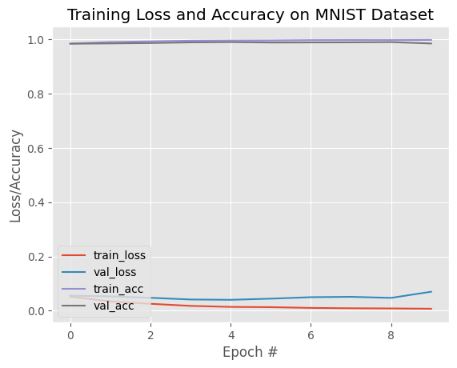

# [Convolutional Neural Network Implementation](https://github.com/tylew/tylew/tree/main/Chapman/Spring%202024/CPSC%20542%3A%20DL%20%26%20CV/ASSN-1)

## Author Information
- **Name:** Lewis, T.
- **Email:** tylewis@chapman.edu
- **ID:** 002366930
- **Date:** 02/27/24

## Project Overview
[(containing repo)](https://github.com/tylew/tylew/tree/main/Chapman/Spring%202024/CPSC%20542%3A%20DL%20%26%20CV/ASSN-1)
This project involves the implementation of a Convolutional Neural Network (CNN) for the purpose of classifying images from the handwritten character datasets. This assignment is part of the coursework for CPSC 542 at Chapman University, focusing on leveraging deep learning for vision-based classification tasks.

## Sources
- [**[DATASET REPO]** Kuzushiji-49 & KMNIST Datasets](https://github.com/rois-codh/kmnist#The%20Dataset)
- [Guide to Lenet Architecture ](https://www.kaggle.com/code/blurredmachine/lenet-architecture-a-complete-guide)
- [Building a CNN pipeline in python](https://pyimagesearch.com/2021/07/19/pytorch-training-your-first-convolutional-neural-network-cnn/)


## Methods
### Preprocessing
- Data should be relatively normalized. For all tests this model has undergone, characters are isolated in a separate process prior to classification.
- A dataset split is applied, allocating 75% of the images for training and 25% for validation. This approach is intended to gauge the model's  capability on unseen data.

### Model Architecture
  The model employs a LeNet architecture, featuring a sequential arrangement of layers designed to process the input images:
  - **Convolutional Layers:** Two convolutional layers are included, where the first layer applies 20 filters of size 5x5, and the second layer uses 50 filters of the same size. These layers are responsible for extracting features from the input images.
  - **Activation Functions:** Each convolutional layer is followed by a ReLU activation function to introduce non-linearity, enhancing the model's learning capability.
  - **Pooling Layers:** Max-pooling layers follow each activation function, reducing the spatial size of the representation and hence the number of parameters and computation in the network.
  - **Fully Connected Layers:** After flattening the output from the convolutional layers, it is passed through a fully connected layer with 500 units, followed by a ReLU activation, culminating in a softmax classifier that outputs the probability distribution over the 10 digit classes.

## Results
- **Training Configuration:** The network is trained over 10 epochs with a batch size of 64, employing the Adam optimizer and a learning rate of 1e-3.
- **Evaluation:** Upon completion of training, the model is assessed on a separate test dataset, and a classification report is generated. This report details the model's precision, recall, and F1-scores for each digit class, offering a comprehensive evaluation of its classification efficacy.
- **Performance Monitoring:** A history of training and validation loss and accuracy is maintained throughout the training epochs, serving as a metric for evaluating the model's performance.


### Evaluation on the Kuzushiji-49 Test Set
- **Accuracy:** The model achieved an overall accuracy of 99% on the test set, indicating a high level of proficiency in classifying handwritten digits from the MNIST dataset.

- **Precision, Recall, and F1-Score by Class:**
```
               precision    recall  f1-score   support

     Class 0       0.93      0.94      0.94      1000
     Class 1       0.97      0.94      0.96      1000
     Class 2       0.94      0.95      0.95      1000
     Class 3       0.83      0.90      0.86       126
     Class 4       0.94      0.91      0.93      1000
     Class 5       0.89      0.88      0.88      1000
     Class 6       0.94      0.90      0.92      1000
     Class 7       0.86      0.93      0.90      1000
     Class 8       0.82      0.93      0.87       767
     Class 9       0.95      0.90      0.93      1000
    Class 10       0.93      0.95      0.94      1000
    Class 11       0.95      0.90      0.93      1000
    Class 12       0.91      0.89      0.90      1000
    ...

    accuracy                           0.92     38547
   macro avg       0.92      0.91      0.91     38547
weighted avg       0.92      0.92      0.92     38547

```
#### Plots/Figures

- A graphical representation showcases the trend in training and validation loss and accuracy across epochs. This visualization aids in identifying any signs of overfitting or underfitting and in understanding how the model's performance evolves with training.
  
### Evaluation on the KMNIST Test Set

- **Accuracy:** The model achieved an overall accuracy of 99% on the test set, indicating a high level of proficiency in classifying handwritten digits from the MNIST dataset.

- **Precision, Recall, and F1-Score by Class:**
  - **0 - Zero:** Precision: 0.99, Recall: 0.99, F1-Score: 0.99
  - **1 - One:** Precision: 1.00, Recall: 0.99, F1-Score: 0.99
  - **2 - Two:** Precision: 0.99, Recall: 0.99, F1-Score: 0.99
  - **3 - Three:** Precision: 0.99, Recall: 0.98, F1-Score: 0.99
  - **4 - Four:** Precision: 0.97, Recall: 1.00, F1-Score: 0.98
  - **5 - Five:** Precision: 0.96, Recall: 0.99, F1-Score: 0.98
  - **6 - Six:** Precision: 0.99, Recall: 0.99, F1-Score: 0.99
  - **7 - Seven:** Precision: 0.98, Recall: 0.99, F1-Score: 0.99
  - **8 - Eight:** Precision: 0.98, Recall: 0.98, F1-Score: 0.98
  - **9 - Nine:** Precision: 0.99, Recall: 0.96, F1-Score: 0.98

#### Plots/Figures



## How to Run the Code
run all cells in Jupyter notebook `model.ipynb`

ensure `helper1.py` is available along with all other necessary imports.

